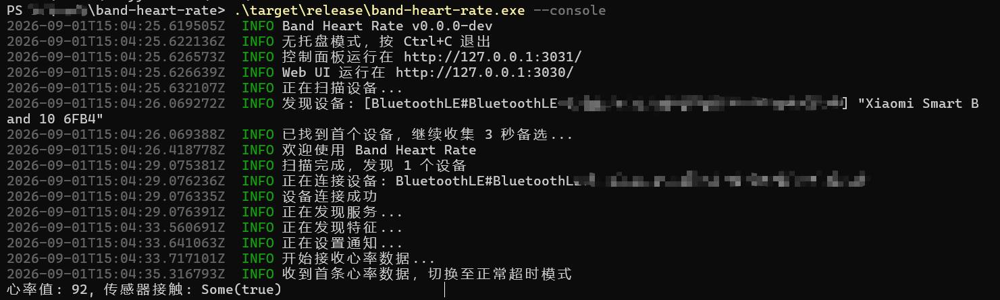
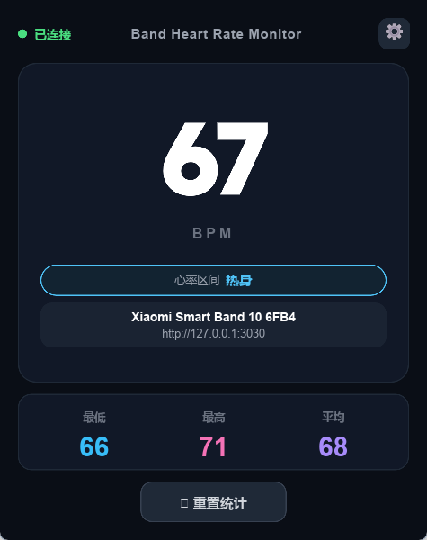

# Band Heart Rate Monitor

> Lightweight system tray heart rate monitor — receives real-time heart rate from wearables via BLE, supports OBS overlay.

🌐 English | [简体中文](README.md)

> ⚠️ Forked from [Tnze/miband-heart-rate](https://github.com/Tnze/miband-heart-rate), code written by AI.

## 📖 About

**Band Heart Rate Monitor** is a lightweight Rust-based system tray application that receives real-time heart rate data from wearable devices via the standard BLE Heart Rate Service (UUID 0x180D). Built-in HTTP server supports REST and SSE real-time push for easy OBS overlay integration.

## ✨ Features

### 🎯 Core

| Feature | Description |
|---------|-------------|
| System Tray Operation | Starts silently to tray by default, no window, minimal resource usage |
| Real-time Heart Rate Display | Large digit display with heart SVG animation in Web UI |
| Windows Notifications | Real-time notifications for scanning, connected, disconnected, timeout, errors |
| Tray Menu | Left-click opens Web UI, right-click: Open Web UI / Copy Address / Quit |
| Auto Reconnect | Automatic scan and reconnect with exponential backoff |
| Control Panel | Independent Web control panel for device management, config changes, manual reconnect |
| Rescan | One-click rescan after timeout without restarting the application |

### 🔗 Integration

| Feature | Description |
|---------|-------------|
| OBS Overlay | `overlay` mode provides transparent background heart rate overlay |
| HTTP API | REST endpoints + SSE real-time push + settings read/write |

### 🛠️ Developer

| Feature | Description |
|---------|-------------|
| Configuration | JSON config file, readable/writable via HTTP API |
| Cross-platform | Headless mode compiles on all platforms |

## 🚀 Quick Start

### Option 1: Download (Recommended)

1. Download the latest version from [GitHub Releases](https://github.com/Roxy-0304/band-heart-rate/releases)
2. Run directly — no installation needed

- **Default**: Starts silently to system tray, no window
- **`--console` flag**: Shows terminal window with log output

### Option 2: Build from Source

```bash
git clone https://github.com/Roxy-0304/band-heart-rate.git
cd band-heart-rate

# Full version (system tray + BLE + web server)
cargo build --release

# Headless version (HTTP API only, no BLE or tray)
cargo build --release --no-default-features
```

### Requirements

- **OS**: Windows (full version) / macOS / Linux (headless mode)
- **Rust**: Edition 2024 (install via [rustup](https://www.rust-lang.org/tools/install) recommended)

> 💡 macOS / Linux note: The tray version targets Windows. Headless mode (`--no-default-features`) compiles on all platforms. Building the tray version on macOS/Linux requires platform-specific dependencies.

## 📖 Usage

### Getting Started

1. Enable **Heart Rate Broadcast** in your band/watch settings
2. Ensure Bluetooth is enabled on your device
3. Run the program — it automatically scans and connects to heart rate devices
4. Tray icon shows real-time heart rate; status changes notify via Windows notifications
5. Left-click tray icon to open Web UI, right-click for menu

### Tray Operations

| Action | Description |
|--------|-------------|
| Left-click tray icon | Open Web UI |
| Right-click tray icon | Menu: Open Web UI / Copy Address / Quit |

### System Notifications

| Notification | Trigger |
|--------------|---------|
| Scanning | Started scanning for Bluetooth devices |
| Connected | Successfully connected to device |
| Disconnected | Device disconnected, reconnecting |
| Timeout | Scan timed out, no device found |
| Error | Bluetooth adapter error etc. |

## ⚙️ Configuration

Settings saved to system config directory:

- **Windows**: `%APPDATA%/band-heart-rate/settings.json`
- Also modifiable via HTTP API

| Setting | Description | Default |
|---------|-------------|---------|
| `max_heart_rate` | Max heart rate (affects zone calculation) | `190` |
| `allowed_devices` | Comma-separated device name keywords | `band,amazfit,watch,mi` |
| `server_port` | HTTP server port | `3030` |
| `auto_start` | Start on system boot | `false` |
| `minimize_to_tray` | Minimize to tray on close | `true` |

## 🔌 API Reference

Default address: `http://127.0.0.1:3030` (configurable; uses random port if occupied).

### Web UI Port (default 3030)

| Method | Endpoint | Description |
|--------|----------|-------------|
| GET | `/` | Web UI page (real-time heart rate display) |
| GET | `/heart-rate` | Current heart rate as JSON |
| GET | `/heart-rate-stream` | SSE real-time heart rate stream |
| GET | `/health` | Health check |

### Control Panel Port (default 3031 = Web port + 1)

| Method | Endpoint | Description |
|--------|----------|-------------|
| GET | `/` | Control panel page |
| GET | `/heart-rate` | Current heart rate as JSON |
| GET | `/devices` | List of discovered devices |
| POST | `/devices/select` | Select device to connect (JSON body: `{"device_id": "..."}`) |
| POST | `/devices/disconnect` | Disconnect current device |
| POST | `/devices/rescan` | Rescan (reset timeout, restart scanning) |
| GET | `/settings` | Get current configuration |
| PUT | `/settings` | Update configuration (JSON body) |

## 📱 Compatible Devices

Compatible with any wearable supporting the standard BLE Heart Rate Service (UUID 0x180D):

- Xiaomi Mi Band ✅ (tested)
- Honor Band ❓
- Huawei Band/Watch ❓
- Amazfit ❓
- Apple Watch ❓

> Enable Heart Rate Broadcast in your device settings to be detected. ❓ means theoretically compatible but not tested.

## ⚠️ Notes

- Heart rate broadcast must be enabled in band/watch settings
- macOS/Linux require platform-specific dependencies for tray version build
- Headless mode (`--no-default-features`) excludes BLE and system tray

## 🙏 Acknowledgments

- [Tnze/miband-heart-rate](https://github.com/Tnze/miband-heart-rate) — Original project

## 📸 Screenshots

**Console Log**



**Control Panel**



## 📄 License

[MIT](LICENSE)
